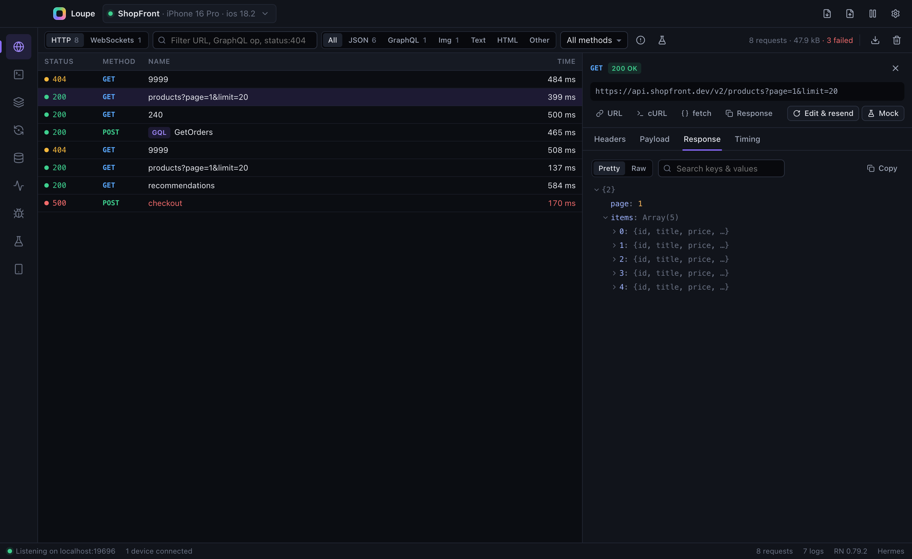
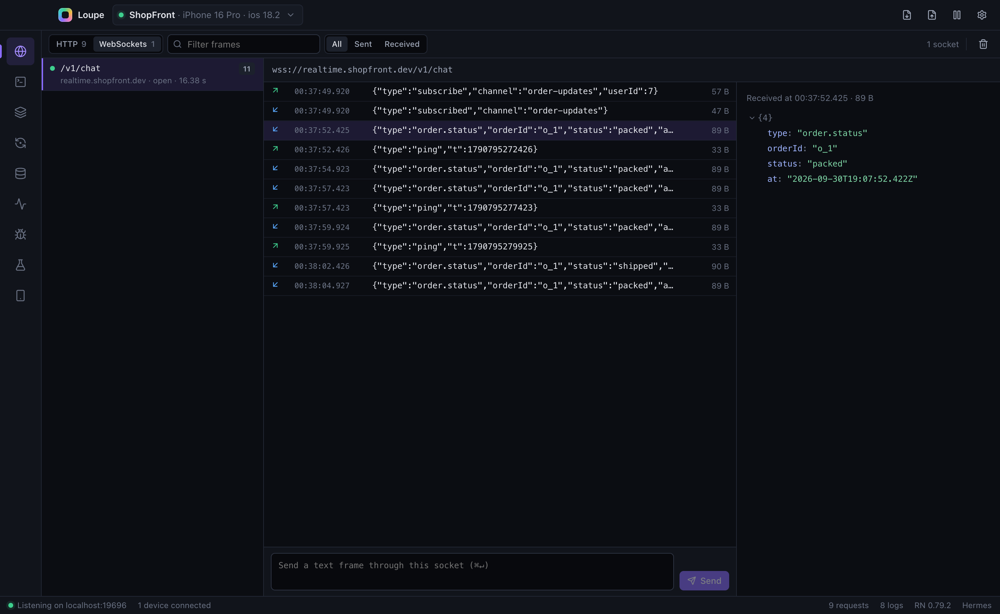
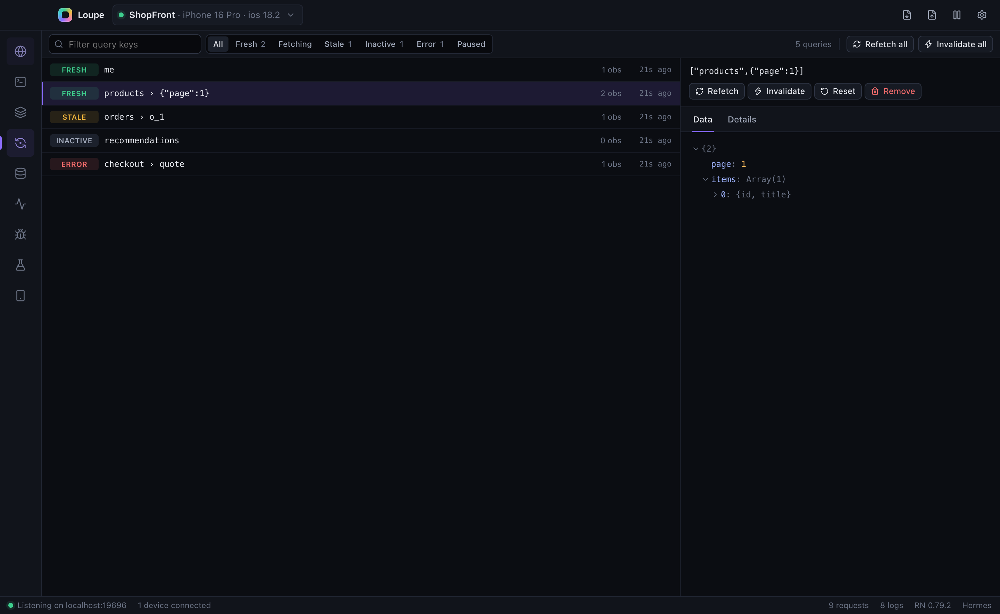
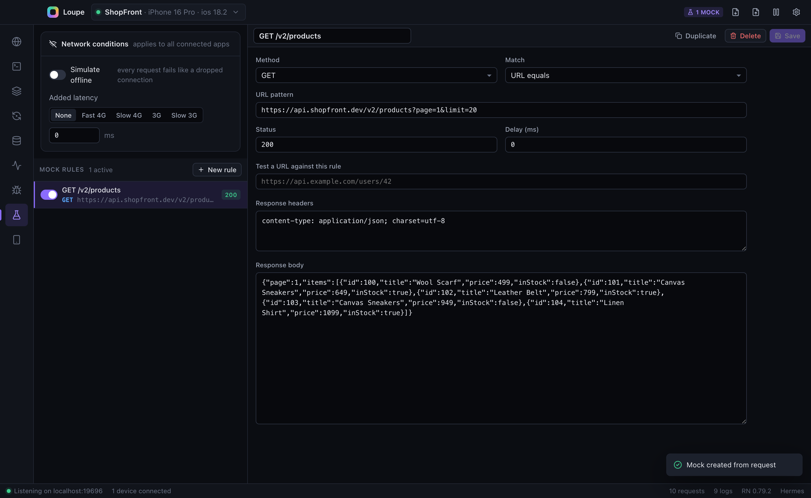
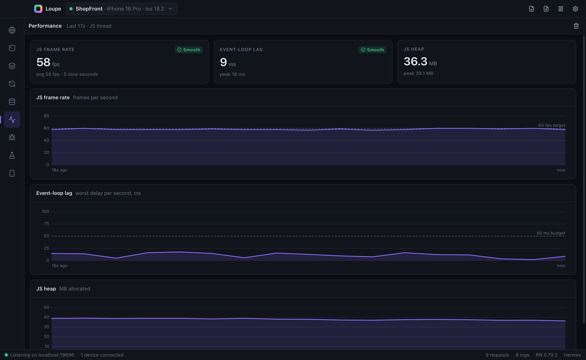

<p align="center">
  
</p>

<h1 align="center">Loupe</h1>

<p align="center">
  <strong>A desktop debugger for React Native.</strong><br />
  Network inspector, WebSockets, TanStack Query, Redux/Zustand state, AsyncStorage, logs, errors and API mocking in one app.<br />
  Add one line to your app. No native code, no config, and it works in Expo Go.
</p>

<p align="center">
  <a href="https://www.npmjs.com/package/loupe-rn"></a>
  <a href="https://www.npmjs.com/package/loupe-rn"></a>
  
  
  <a href="LICENSE"></a>
</p>

<p align="center">
  
</p>

---

## Why Loupe?

Debugging React Native usually means juggling several tools. Flipper's React Native integration was removed in RN 0.74, `console.log` doesn't show you response bodies, and seeing network traffic, state and storage together often means extra native setup.

Loupe puts all of it in **one fast desktop window**, connected over a WebSocket by a **zero-dependency JavaScript SDK**:

- 🔌 **One line to set up.** No native modules, no pods, no rebuild. Works with Expo Go and bare React Native.
- 🌐 **See every request.** `fetch`, axios and `XMLHttpRequest`, with headers, bodies, timing and GraphQL operation names.
- 🧪 **Mock any API** from the desktop: change status, body or delay, go offline, or throttle to "Slow 3G".
- 🧠 **Inspect the app's brain.** TanStack Query cache, Redux/Zustand state with diffs and time travel, React Navigation, AsyncStorage.
- 🛡️ **Safe by default.** The SDK does nothing in release builds, and exports hide auth tokens and passwords.

## Quick start

**1. Download the desktop app**

| Platform | Download |
|---|---|
| macOS, Apple Silicon (M1–M5) | [**Loupe-mac-arm64.dmg**](https://github.com/akshayrastogi-md/Loupe/releases/latest/download/Loupe-mac-arm64.dmg) |
| macOS, Intel | [**Loupe-mac-x64.dmg**](https://github.com/akshayrastogi-md/Loupe/releases/latest/download/Loupe-mac-x64.dmg) |
| Windows, Linux | Installers coming soon. For now, [build from source](#build-from-source) (`npm run dist`). |

Open the `.dmg` and drag **Loupe** into Applications. Current builds aren't notarized yet, so on first launch macOS blocks the app: open **System Settings → Privacy & Security** and click **Open Anyway** (you only do this once). All releases are on the [Releases page](https://github.com/akshayrastogi-md/Loupe/releases).

**2. Add the SDK to your app:**

```bash
npm install --save-dev loupe-rn
```

```ts
// index.js: import before your App
import createLoupe from 'loupe-rn'

export const loupe = createLoupe({ appName: 'My App' }).connect()
```

**3. Run your app.** It shows up in Loupe right away. That's it.

<details>
<summary><strong>Optional: connect state, queries, navigation and storage</strong></summary>

```ts
import AsyncStorage from '@react-native-async-storage/async-storage'

export const loupe = createLoupe({ appName: 'My App', asyncStorage: AsyncStorage }).connect()

loupe.trackQueryClient(queryClient)                    // TanStack Query → Queries panel
loupe.trackZustand('cart', useCartStore)               // Zustand → State panel
configureStore({ reducer, enhancers: (d) => d().concat(loupe.reduxEnhancer()) }) // Redux Toolkit
loupe.trackNavigation(navigationRef)                   // React Navigation
loupe.registerCommand({ id: 'logout', title: 'Log out', handler: logout }) // buttons in Loupe
```

The full SDK reference is in [client/README.md](client/README.md).

</details>

## Features

### 🌐 Network inspector

Every request with status, timing and a waterfall. Filter by URL, `status:404`, type or method. Open the headers, payload and a searchable JSON response tree. **Copy as cURL or fetch()**, **edit & resend** from the device or desktop, **export HAR** with secrets hidden, and turn any response into a mock in one click.

### ⚡ WebSocket inspector

Chat, live updates and GraphQL subscriptions: every frame in both directions, with JSON previews. You can also **send frames into a live socket** from the desktop.



### 🔁 TanStack Query panel

Every cached query with its fresh, stale, fetching, inactive or error state, plus data, observers and errors. **Refetch, invalidate, reset or remove** any query, or all of them.



### 🧪 API mocking and network conditions

Intercept matching requests inside the app and return your own status, headers, body and delay, with no backend changes. Simulate **offline mode** or **slow networks** to test loading and error states.



### And much more

| | |
|---|---|
| **State** | Redux, Zustand or any store: action log, diffs, dispatch from the desktop, time travel |
| **Console** | Live `console.*` output with level filters, search and expandable objects |
| **Errors** | Grouped JS errors, readable stack traces, **Metro symbolication**, open in editor |
| **Performance** | Live JS frame rate, event-loop lag and Hermes heap charts |
| **Storage** | View, edit and delete AsyncStorage keys (v2 and v3) |
| **Device tools** | One-click **React Native DevTools debugger**, deep-link launcher, reload, `adb reverse`, custom commands |
| **Sessions** | Export a full capture as a `.loupe` file and share it with a teammate |



## Works with

**React Native** 0.70+ (tested on 0.86 and 0.87) · **Expo**, including Expo Go · **Hermes** and JSC · iOS simulator, Android emulator and physical devices · `fetch`, **axios**, `XMLHttpRequest`, **WebSockets** · **TanStack Query** · **Redux Toolkit** · **Zustand** · **React Navigation** · **AsyncStorage** v2 and v3

## FAQ

<details>
<summary><strong>Does it affect production builds?</strong></summary>

No. `createLoupe` defaults to `enabled: __DEV__`, so release builds get an inert client: nothing is patched and no socket is opened.
</details>

<details>
<summary><strong>How does it connect to a physical device?</strong></summary>

The SDK tries the Metro host first, then `localhost` (iOS simulator) and `10.0.2.2` (Android emulator). For a phone on Wi‑Fi, turn on **Settings → Allow LAN connections** in Loupe. For Android over USB, click **adb reverse** in the Device panel.
</details>

<details>
<summary><strong>Is it a replacement for React Native DevTools?</strong></summary>

It complements it. React Native DevTools gives you the JS debugger and profiler, and Loupe opens it for you in one click. Loupe adds the app-level views: network mocking, WebSockets, query cache, state, storage and shareable sessions.
</details>

<details>
<summary><strong>Is my data sent anywhere?</strong></summary>

No. Everything stays on your machine. By default Loupe only accepts connections from `localhost`, and browser pages are rejected. See [SECURITY.md](SECURITY.md).
</details>

<details>
<summary><strong>Why can't it see some uploads or image loads?</strong></summary>

Libraries that send requests from native code (for example `react-native-blob-util`) bypass the JavaScript network layer. Native capture is on the roadmap.
</details>

## Build from source

```bash
git clone https://github.com/akshayrastogi-md/Loupe.git && cd Loupe
npm install
npm run dev        # run with hot reload
npm run demo       # connect a simulated device (second terminal)
npm run dist       # build installers: dmg (macOS), NSIS (Windows), AppImage/deb (Linux)
```

## Contributing

Issues and pull requests are welcome. See [CONTRIBUTING.md](CONTRIBUTING.md). If Loupe saves you time, a ⭐ on GitHub helps other React Native developers find it.

## License

[MIT](LICENSE) © Akshay Rastogi
